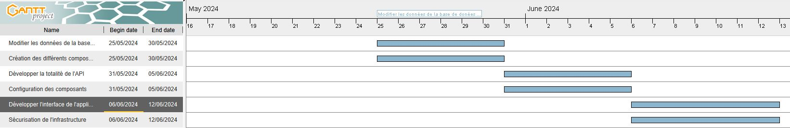

# Table of Contents
- [**Description**](#description)
- [**Context**](#context)
- [**Features**](#features)
- [**Gantt Chart**](#gantt-chart)
- [**Technologies Used**](#technologies-used)
- [**Success Criteria**](#success-criteria)
- [**Roles and Responsibilities**](#roles-and-responsibilities)

## Description
Our project (YPlanning) aims to manage courses (inspired by YNOV HyperPlanning). It is a web application that allows students to view their courses and grades. Another part of the project is reserved for teachers, who can enter student grades, take attendance, and send the course materials to students.

|                |                                                          |
|:---------------|:---------------------------------------------------------|
| Project Name   | YPlanning                                                |
| Project Lead   | MIHUTA Mihail                                            |
| Team           | MIHUTA Mihail   TCHOKOTE HAPPY Joël Christian         |
| GitHub         | [YPlanning](https://github.com/MihutaMihail/YPlanning)   |

## Context
- <ins>MIHUTA Mihail</ins>  
This project allows me to work more with C# and PHP, use new tools like an ORM (Object Relational Mapper), and integrate my code with the infrastructure (DevOps).

- <ins>TCHOKOTE HAPPY Joël Christian</ins>  
This project allows me to set up an infrastructure with multiple servers, a firewall, and manage the configuration and security of the infrastructure, supporting my journey in cybersecurity.

## Features
### Authentication

### Administrator

### Student

### Teacher

## Gantt Chart

### <ins>25/05 - 30/05</ins>
### Modify the Database Data with the API (<ins>dev</ins>)
- Have a container for the database server
- Have a container for the API (docker file + docker compose conf file)
- Use the ASP.NET Core framework for API development
- Use Entity Framework (EF) Core as an ORM
- Communicate between the API and the database to modify data on the server
- Generate an SSL certificate to access HTTPS and export it to Docker

### Create the Various Infrastructure Components (<ins>infra</ins>)
- Have a container for the Nginx server as a reverse proxy and web server
- Create DNS and DHCP servers
- Create VLANs

### <ins>31/05 - 05/06</ins>
### Develop the Entire API (<ins>dev</ins>)
- CRUD operation endpoints for the administrator
- CRUD operation endpoints for courses
- CRUD operation endpoints for students
- CRUD operation endpoints for teachers

### Configuration of Components (<ins>infra</ins>)
- Configure the reverse proxy
- Configure the web server
- Configure the DNS server
- Configure the DHCP server
- Configure VLANs

### <ins>06/06 - 12/06</ins>
### Develop the Application Interface (<ins>dev</ins>)
- Use HTML / CSS / PHP
- Link the application interface with the API

### Secure the Infrastructure (<ins>infra</ins>)
- Create ACLs
- Configure the Nginx server to use it as a firewall

## Technologies Used
### Dev
- Visual Studio for IDE
- C# for API development
- ASP.NET Core as a framework
- Entity Framework (EF) Core as an ORM

### Infra
- Docker for server usage
- PostgreSQL or MySQL for the web server
- ...

## Success Criteria
The functionalities required for the project to be considered viable are:

- *An authentication system*
- *Students can view courses* 
- *Students can view their grades*
- *Teachers can take attendance*
- *Teachers can assign grades*
- *Administrators can perform CRUD operations (Create, Read, Update, Delete) on courses as well as on students*

## Roles and Responsibilities
**MIHUTA Mihail** --- <ins>*Developer*</ins>

<ins>Responsibilities</ins>
- API development (authentication, CRUD operations, database interaction)
- Front-end development (interface) to interact with the back-end
- Database integration
- API and database images for Docker
- Dev part of the technical documentation
- Prepare the README and other documentation files

---

**TCHOKOTE HAPPY Joël Christian** --- <ins>*Security and Infrastructure Engineer*</ins>

<ins>Responsibilities</ins>
- Set up the infrastructure (servers, firewall, VLANs)
- Infrastructure configuration (DNS server, DHCP, web server, and database server)
- Secure the infrastructure (access management (ACL), firewall configuration)
- Reverse proxy image for Docker
- Help develop the graphical interface
- Infra part of the technical documentation
- UML detailing the database
- Create use case diagrams
