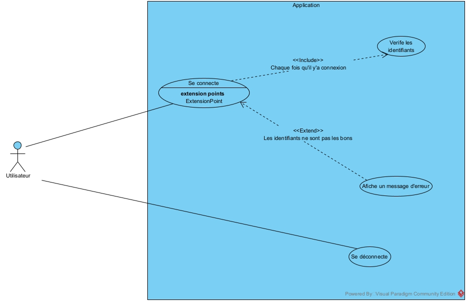
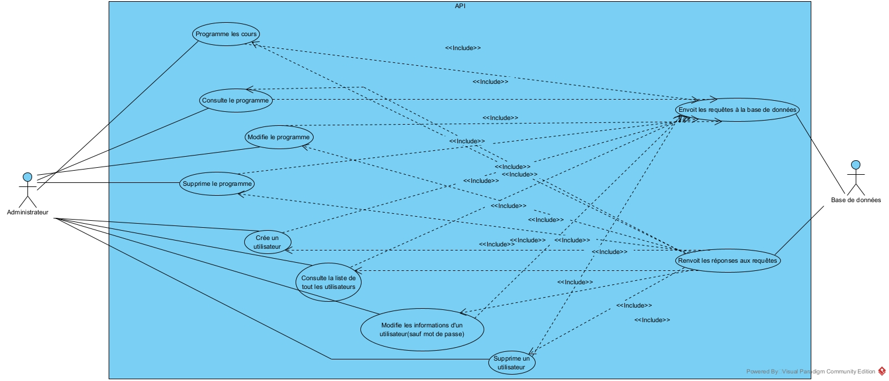
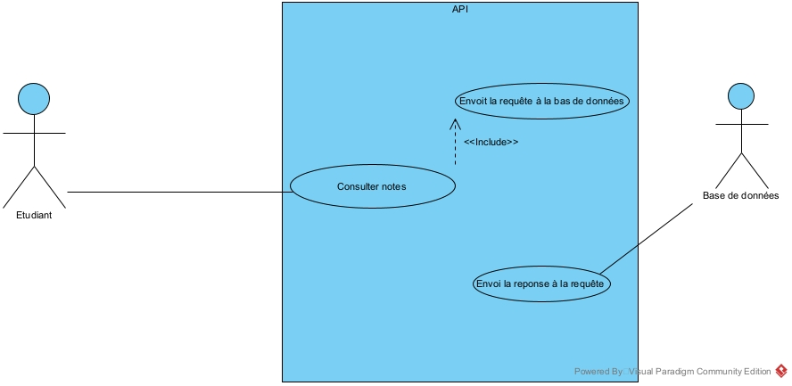
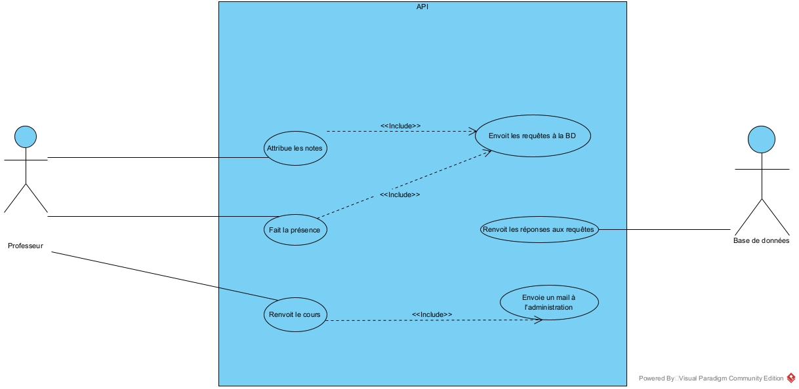

# Sommaire
- [**Description**](#description)
- [**Contexte**](#contexte)
- [**Fonctionnalités**](#fonctionnalités)
- [**Diagramme Gantt**](#diagramme-gantt)
- [**Technologies Utilisées**](#technologies-utilisées)
- [**Critères de succés**](#critères-de-succès)
- [**Rôles et Responsabilités**](#rôles-et-responsabilités)

## Description
Notre projet (YPlanning) a comme but la gestion des cours (inspiré
de YNOV HyperPlanning). C’est une application web qui permet
aux étudiants de consulter les cours et de regarder leurs notes.
L’autre partie du projet sera conservée pour les professeurs qui
pourront mettre les notes des étudiants, faire la présence et
renvoyer le cours aux élèves.

|                |                                                          |
|:---------------|:---------------------------------------------------------|
| Nom de projet  | YPlanning                                                |
| Chef de projet | MIHUTA Mihail                                            |
| Équipe         | MIHUTA Mihail   TCHOKOTE HAPPY Joël Christian         |
| GitHub         | [YPlanning](https://github.com/MihutaMihail/YPlanning)   |

## Contexte
- <ins>MIHUTA Mihail</ins>  
Ce projet me permet de travailler plus avec C# et PHP, utiliser des
nouveaux outils comme un ORM (Object Relational Mapper) ainsi
que d’intégrer mon code avec l'infrastructure (DevOps).

- <ins>TCHOKOTE HAPPY Joël Christian</ins>  
Ce projet me permet de mettre en place une infrastructure
comprenant plusieurs serveurs, un pare-feu, ainsi que de gérer la
configuration et la sécurisation de l’infrastructure qui soutiendra
mon parcours dans la cybersécurité.

## Fonctionnalités
### Authentification

### Administrateur

### Etudiant

### Professeur

## Diagramme GANTT

### <ins>25/05 - 30/05</ins>
### Modifier les données de la base de données avec l'API (<ins>dev</ins>)
- Avoir un conteneur pour le serveur de base de données
- Avoir un conteneur pour l'API (docker file + docker compose conf file)
- Utilisation du framework ASP.NET Core pour le développement de l'API
- Utilisation du Entity Framework (EF) Core en tant que ORM
- Communication entre l'API et la base de données pour modifier les données sur le serveur
- Générer un certificat SSL pour avoir accès en HTTPS et l'exporter dans Docker

### Création des différents composants de l'infrastructure (<ins>infra</ins>)
- Avoir un conteneur du serveur Nginx en tant que proxy inverse et serveur web
- Création des serveurs DNS, DHCP
- Création des VLANs

### <ins>31/05 - 05/06</ins>
### Développer la totalité de l'API (<ins>dev</ins>)
- Endpoints des opérations CRUD pour l'administrateur
- Endpoints des opérations CRUD pour les cours
- Endpoints des opérations CRUD pour les elèves
- Endpoints des opérations CRUD pour les professuers

### Configuration des composants (<ins>infra</ins>)
- Configuration du proxy inverse
- Configuration du serveur web
- Configuration du DNS
- Configuration du DHCP
- Configuration des VLANs

### <ins>06/06 - 12/06</ins>
### Développer l'interface de l'application (<ins>dev</ins>)
- Utilisation du HTML / CSS / PHP
- Mettre en lien l'interface de l'application et l'API

### Sécurisation de l'infrastructure (<ins>infra</ins>)
- Création des ACLs
- Configuration de serveur Nginx pour l'utiliser en tant que pare-feu

## Technologies Utilisées
### Dev
- Visual studio pour IDE
- C# pour le développement de l'API
- ASP.NET Core en tant que framework
- Entity Framework (EF) Core en tant que ORM

### Infra
- Docker pour l'utilisation des serveurs
- PostgreSQL ou MySQL pour le serveur web
- ...

## Critères de succès
Les fonctionnalités à avoir pour que le projet soit considéré comme viable sont :

- *Un système d’authentification*
- *Les étudiants peuvent consulter les cours* 
- *Les étudiants peuvent regarder leurs notes*
- *Les professeurs peuvent faire la présence*
- *Les professeurs peuvent attribuer des notes*
- *Les administrateurs peuvent faire des opérations CRUD (Create, Read, Update, Delete) sur les cours ainsi que sur les étudiants*

## Rôles et responsabilités
**MIHUTA Mihail** --- <ins>*Développeur*</ins>

<ins>Responsabilités</ins>
- Développement de l’API (authentification, opération CRUD, interaction avec base de données)
- Développement du Front (l’interface) pour interagir avec le Backend
- Intégration de la base de données
- Image API et base de données pour Docker
- Partie dev de la documentation technique
- Préparer le README et le reste des fichiers de documentation

---

**TCHOKOTE HAPPY Joël Christian** --- <ins>*Ingénieur en sécurité et infrastructure*</ins>

<ins>Responsabilités</ins>
- Mettre en place l’infrastructure (serveurs, pare-feu, vlans)
- Configuration de l’infrastructure (serveur dns, dhcp, web et base de données)
- Sécurisation de l’infrastructure (gestion des accès (ACL), configuration pare-feu)
- Image proxy inverse pour Docker
- Aide au développement de l'interface
- Partie infra de la documentation technique
- UML détaillant la base de données
- Création des schémas pour les usages (use case)
