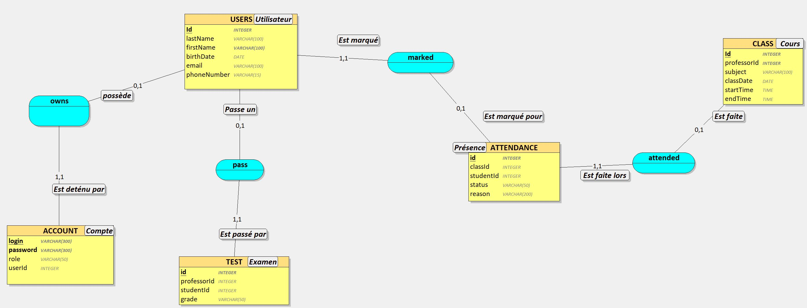

# Table of Contents
- [**Project Overview**](#project-overview)
- [**Stack**](#stack)
- [**Architecture Diagram**](#architecture-diagram)
- [**Database Diagram**](#database-diagram)
- [**Prerequisites**](#prerequisites)
- [**Setup and Installation**](#setup-and-installation)
- [**Docker Configuration**](#docker-configuration)
- [**API Documentation**](#api-documentation)

## Project Overview
- Name
- Purpose
- Components (database server, api server, etc) 

## Stack
<ins>Backend Framework</ins> → ASP.NET Core <br>
<ins>Database</ins> → PostgreSQL Server <br>
<ins>ORM</ins> → Entity Framework (EF) Core <br>
<ins>Web Server</ins> → Nginx Server <br>
<ins>Deployment Platform</ins> → Docker <br>
<ins>API IDE</ins> → Visual studio
<ins>Postgre IDE</ins> → pgAdmin

## Architecture Diagram
- Visual diagram showing the interaction between each component 
- Explain each component of the architecture, why is was made the way that it is, etc

## Database Diagram
Here's the CDM (Conceptual Data Model) of the database


And here's the SQL code for it
```
CREATE TABLE USERS(
   id SERIAL,
   lastName VARCHAR(100) NOT NULL,
   firstName VARCHAR(100) NOT NULL,
   birthDate DATE NOT NULL,
   email VARCHAR(100) NOT NULL,
   phoneNumber VARCHAR(15),
   role VARCHAR(50),
   PRIMARY KEY (id)
);

CREATE TABLE ACCOUNTS(
   id SERIAL,
   login VARCHAR(300) NOT NULL UNIQUE,
   password VARCHAR(300) NOT NULL,
   accountCreationDate DATE,
   lastLoginDate DATE,
   userId INTEGER NOT NULL,
   PRIMARY KEY(id),
   FOREIGN KEY(userId) REFERENCES USERS(id)
);

CREATE TABLE CLASSES(
   id SERIAL,
   subject VARCHAR(100) NOT NULL,
   classDate DATE NOT NULL,
   startTime TIME NOT NULL,
   endTime TIME NOT NULL,
   PRIMARY KEY(id)
);

CREATE TABLE ATTENDANCES(
   classId INTEGER NOT NULL,
   userId INTEGER NOT NULL,
   status VARCHAR(50) NOT NULL,
   reason VARCHAR(200),
   PRIMARY KEY(classId, userId),
   FOREIGN KEY(classId) REFERENCES CLASSES(id),
   FOREIGN KEY(userId) REFERENCES USERS(id)
);

CREATE TABLE TESTS(
   id SERIAL,
   classId INTEGER NOT NULL,
   userId INTEGER NOT NULL,
   score VARCHAR(50) NOT NULL,
   PRIMARY KEY(id),
   FOREIGN KEY(classId) REFERENCES CLASSES(id),
   FOREIGN KEY(userId) REFERENCES USERS(id)
);
```

## Prerequisites
- Prerequisites like installing Docker 
- Cloning the repository, what to do with it to install

## Setup and Installation
- How to build docker images 
- How to start the application  
- How to access different services like http://localhost:3000 for the api server and http://localhost:5000 for the nginx server
- **Anything that is needed to run the application**

## Usage
- Explain how to use the application
- How to call endpoint
- What to expect from these endpoint
- Maybe a high-level flow

## Docker Configuration
- Explain how docker works (images, containers, volumues) 
- Indicate the images that we have in our project and what is their roles (database, api and nginx) 
- Explain the concept of a docker file and how it works

## Server Configuration
- Show and explain each server configuration

## API Documentation
- Add "refer to **api_doc**" 
- Explain what are endpoints, how do they work, how to access them
- Indicate that if you want to know more, check out the API Documentation where you can see the endpoints, results, etc
