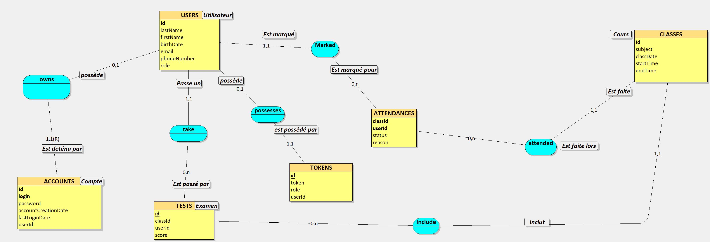

# Table of Contents
- [**Project Overview**](#project-overview)
- [**Stack**](#stack)
- [**Architecture Diagram**](#architecture-diagram)
- [**Database Diagram**](#database-diagram)
- [**Prerequisites**](#prerequisites)
- [**Installation**](#installation)
- [**Docker**](#docker)
- [**API Documentation**](#api-documentation)

## Project Overview
- **Name** → YPlaning
- **Purpose** → Manage courses, have teachers grade and take attendance of their students, while having the students view their courses throughout the week as well their scores.
- **Components** → C# API, Docker containers, PostgreSQL server, Nginx web server, Infrastructure (dhcp, dns, vlans)

## Stack
- **Backend Framework** → ASP.NET Core <br>
- **Database** → PostgreSQL Server <br>
- **ORM** → Entity Framework Core <br>
- **Web Server + Reverse Proxy** → Nginx Server <br>
- **Deployment Platform** → Docker <br>
- **Backend IDE** → Visual studio 2022
- **Database IDE** → pgAdmin 4

## Architecture Diagram


- **DNS Server** → Used to translate a domain name into an IP address
- **Mail Server** → Used to receive and handle emails
- **Web Server** → Used to host our website (interface)
- **Database Server** → Used to store data or access data

## Database Diagram
Here's the CDM (Conceptual Data Model) of the database


And here's the SQL code for it
```
CREATE TABLE USERS(
   id SERIAL,
   lastName VARCHAR(100) NOT NULL,
   firstName VARCHAR(100) NOT NULL,
   birthDate DATE NOT NULL,
   email VARCHAR(100) NOT NULL,
   phoneNumber VARCHAR(15),
   role VARCHAR(50) NOT NULL,
   PRIMARY KEY (id)
);

CREATE TABLE ACCOUNTS(
   id SERIAL,
   login VARCHAR(300) NOT NULL UNIQUE,
   password VARCHAR(300) NOT NULL,
   accountCreationDate DATE,
   lastLoginDate DATE,
   userId INTEGER NOT NULL,
   PRIMARY KEY(id),
   FOREIGN KEY(userId) REFERENCES USERS(id)
);

CREATE TABLE CLASSES(
   id SERIAL,
   subject VARCHAR(100) NOT NULL,
   classDate DATE NOT NULL,
   startTime TIME NOT NULL,
   endTime TIME NOT NULL,
   room VARCHAR(10) NOT NULL,
   PRIMARY KEY(id)
);

CREATE TABLE ATTENDANCES(
   id SERIAL,
   classId INTEGER NOT NULL,
   userId INTEGER NOT NULL,
   status VARCHAR(50) NOT NULL,
   reason VARCHAR(200),
   PRIMARY KEY(id),
   FOREIGN KEY(classId) REFERENCES CLASSES(id),
   FOREIGN KEY(userId) REFERENCES USERS(id)
);

CREATE TABLE TESTS(
   id SERIAL,
   classId INTEGER NOT NULL,
   userId INTEGER NOT NULL,
   score VARCHAR(50) NOT NULL,
   PRIMARY KEY(id),
   FOREIGN KEY(classId) REFERENCES CLASSES(id),
   FOREIGN KEY(userId) REFERENCES USERS(id)
);
```

## Prerequisites

| Tool / Resource                                                 | Description |
|:----------------------------------------------------------------|:------------|
| [Docker](https://www.docker.com/products/docker-desktop/)       | Used for deploying the API and PostgreSQL server <br> *(version used 4.30.0)* |
| [.NET SDK](https://dotnet.microsoft.com/en-us/download/dotnet/) | Mandatory for the API to function **(choose .NET 6.0)** |
| [pgAdmin 4](https://www.pgadmin.org/download/pgadmin-4-windows/) | Used for managing and viewing your PostgreSQL database <br> *(choose the latest version)* |
| [Postman](https://www.postman.com/downloads/) | Used for accessing endpoints <br> *(choose the latest version)* |
| [Repository](https://github.com/MihutaMihail/YPlanning/)        | Clone the repository onto your computer |

## Installation

**Before beginning, make sure that you have access to all tools / resources specified inside** [**Prerequisites**](#prerequisites)

Another thing to note, inside the **/Dev/YPlanning/AppSetup/seed.sql** file, there are some data that are not insert by default. If you wish to test all endpoints, you can uncomment those insert as to have some data to play with.

1. Go to **/Dev/YPlanning/AppSetup/seed.sql**. This is how the [file looks like](/Dev/YPlanning/AppSetup/seed.sql). <br>
Follow the instructions over there and come back here when indicated. <br>
**TO NOTE: DO THIS INSIDE THE CLONED REPOSITORY**
2. Inside the same PowerShell window, choose option 1 → **FULL SETUP (RECOMMENDED)**
3. It will ask you to create a certificate if you don't already have one. If you have one, you can use your existing certificate.
4. Everything else that will require an input are the passwords for the certificate and the database. You will need to type the same password twice, once when creating the certificate and database, and once when building the API so that it can have access to the aforementioned elements using the password that you have chosen in the previous step.
5. **YOU'RE DONE**. The API and PostgreSQL containers should be running, you can view the database using **pgAdmin 4** (use same password as chosen inside the script) or even access the SWAGGER documentation on https://localhost:443/swagger/index.html
<br>
<br>

**IF IT DOESN'T WORK**
- A valid and trusted certificate is *mandatory*. Using PowerShell, you can type the following command to make sure that your certificate is trusted.
```
dotnet dev-certs https --trust --check
```
If executing this command doesn't return a message along the lines of "A trusted certificate was found: ...". You can execute the following command to make sure that your certificate is trusted
```
dotnet dev-certs https --trust
```

- You may need to restart your browser. Sometimes chrome (or perhaps another browser) will keep using your old certificate. If you have generated a new certificate, this may be the root of the problem.

- Make sure that the password that you have chosen is the same each time a password input is prompted. You can always re-execute the **setup.ps1** script with the following option **1. FULL SETUP (RECOMMMENDED)** to reinstall everything.

## Usage

**Before beginning, make sure that you have followed closely every step inside** [**Installation**](#installation)

Before starting to call the wanted endpoints, make sure import the given [Postman Collection](Documentation/YPlanning.postman_collection.json) into your Postman. You can download the json file from here or just choose the file from inside the cloned repository when importing the collection.

**Remember the encrypted token that you have inserted inside this [file](/Dev/YPlanning/AppSetup/seed.sql) ?** <br>
The purpose of that was to create a *TEMPORARY* token with admin level access so that you can create your own user and account.

1. Using the non encrypted version of the token copied from **step 1**, you will access the *CreateUser* and *CreateAccount* endpoints using **Postman**. To use the token, head over to the **Headers** area of the request, and insert your token inside the **Value** column (the name has already been inserted for you)
2. Now, you can create your user and account with your own data <br>
*(TO NOTE: make sure that the userId corresponds to the Id of the newly created user)*
3. Once both of them has been created, you can now access the **Login** endpoint in which you will need to insert your account login and password. If successfully logged in, a token will be returned. This token will be given to you as long you don't delete your own account, so you don't have to store it, but you can if you want.
4. **YOU'RE DONE**. You have now created your own user and its account. You have also managed to log in into your account and your token has been generated. Using this token, you can delete the *TEMPORARY* user (the token will be deleted with it).

**IMPORTANT**
- When creating the user, make sure you give it a role of a value equal to **admin**, **student** or **teacher** (case-sensitive). If not, your token will not be recognized and your token will be worthless.

- Don't forget that certain endpoints can only be used when having an admin level token (i.e. CreateUser). If you create a user with a role of **student**, you will be able to use certain endpoints, but not all of them.

## Docker
- The main components of Docker that we're going to use are the **Images** and **Containers**.

### Images
A docker image is a standalone, executable package that includes everything needed to run a piece of software. This includes the code itself, runtime, libraries, environment variables and configuration files. In a way it's similar to how a .iso file contains all necessary components to set up an operating system or how a class in object-oriented programming where it defines a blueprint or template for creating that said class. These images are going to be used for creating Docker containers.

### Containers
Continuing with the class analogy, you could think of containers as the instance of that class. Each container is a running instance of the image with its own state and data. This means that multiple containers can be created from the same image just as multiple objects can be instantiated from the same class.

In our project, we have two containers, **YPlanning** (API) and **postgres** (PostgreSQL server).

- But how are these images created ? In the context of our API for example, it is created using the following command
```
docker build -t IMAGE_NAME DOCKERFILE_DIR_LOCATION
```

In the context of the API, the DOCKERFILE will look different from others. The C# DOCKERFILE will first built the .NET app to then deploy it and finally create the final runtime image. After this step, you can expose certains ports like 443 for HTTPS, you could add certain environment variables that can only be accessed inside the built container or just copy any file. To finish, you must set an entrypoint which would be a .dll file that is going to start everything that the DOCKERFILE has built.

## Server Configuration
- Show and explain each server configuration

## API Documentation
At the moment, the API documentation is not available. However, an automatically generated SWAGGER documentation containing all endpoints can be accessed [here](https://mihutamihail.github.io/YPlanning).

TO NOTE: this SWAGGER documentation will not look the same as the SWAGGER documentation that you will use on https://localhost:443/swagger/index.html. That is because this is a HTML representation of the JSON code that you can find [here](../swagger.json) using [Swagger Editor](https://editor.swagger.io/).